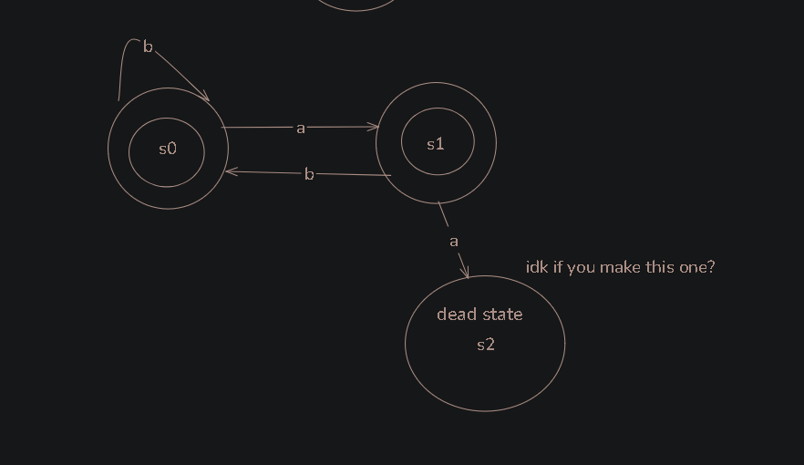
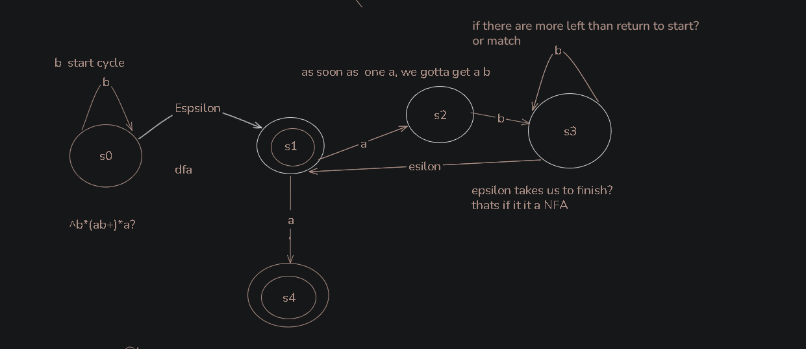
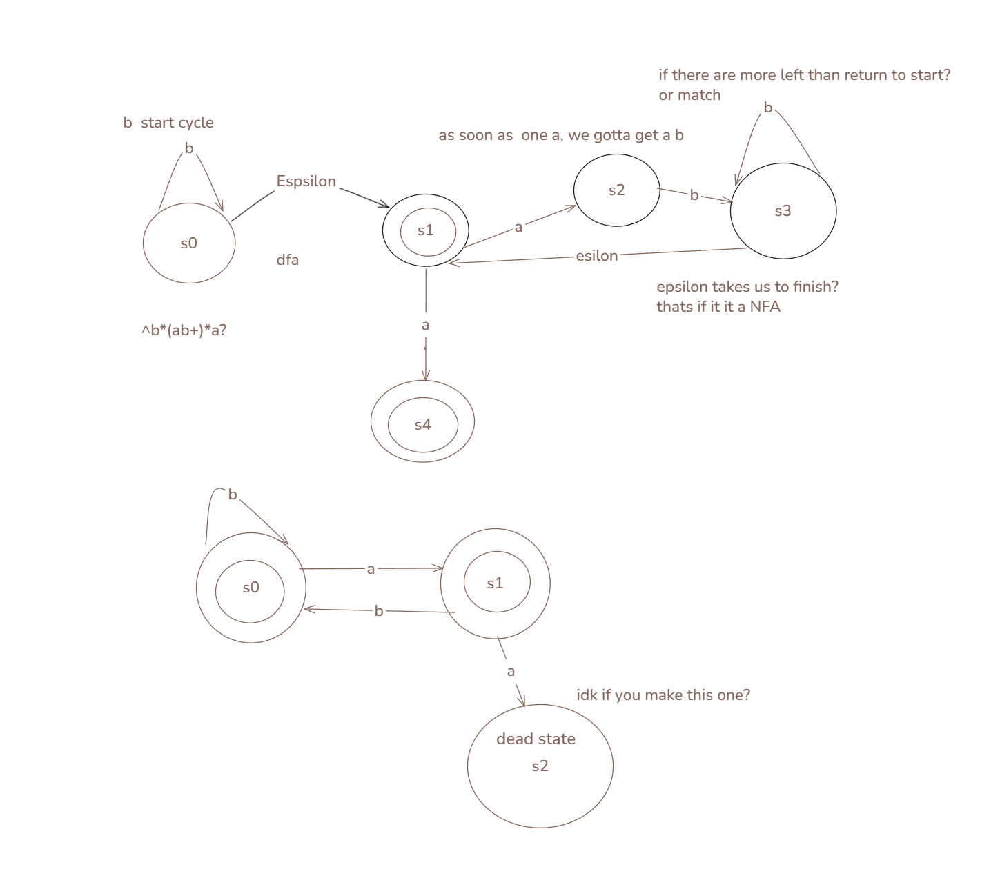
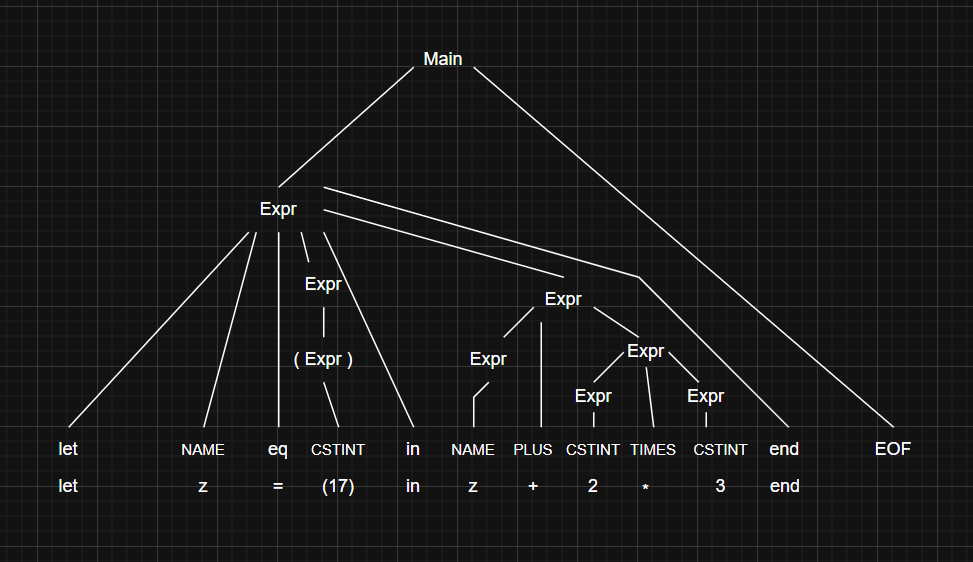

# Group "xXNillermafiaXx" Assignment 02
PLC 2.4, 2.5 (ex2_45.pdf, Machine.java), 3.2, 3.3, 3.4


## Exercise 2.4
Write a bytecode assembler (in F#) that translates a list of bytecode
instructions for the simple stack machine in Intcomp1.fs into a list of
integers. The integers should be the corresponding bytecodes for the interpreter
in Machine.java. Thus you should write a function assemble : sinstr
list -> int list.
Use this function together with scomp from Intcomp1.fs to make a compiler
from the original expressions language expr to a list of bytecodes int list.
28 2 Interpreters and Compilers
You may test the output of your compiler by typing in the numbers as an int
array in the Machine.java interpreter. (Or you may solve Exercise 2.5 below to
avoid this manual work).

`assemble : sinstr list -> int list` walks the instruction list and turns each `sinstr` into its opcode. `SCstI` and `SVar` take an argument so they emit two integers, the rest emit one.

```fsharp
let rec assemble (inss : sinstr list) : int list =
    match inss with
    | (SCstI x) :: tail -> 0 :: x :: assemble tail
    | (SVar x)  :: tail -> 1 :: x :: assemble tail
    | SAdd :: tail  -> 2 :: assemble tail
    | SSub :: tail  -> 3 :: assemble tail
    | SMul :: tail  -> 4 :: assemble tail
    | SPop :: tail  -> 5 :: assemble tail
    | SSwap :: tail -> 6 :: assemble tail
    | [] -> []
```

The slides split this into `sinstrToInt` plus a fold, but one recursive function does the same thing.
 
With `scomp` this compiles `expr` all the way to bytecode:
 
```fsharp
intsToFile (assemble (scomp e1 [])) "is1.txt";;
```


## Exercise 2.5
Modify the compiler from Exercise 2.4 to write the lists of integers to
a file. An F# list ints of integers may be output to the file called fname using this
function (found in Intcomp1.fs):

```fsharp
let intsToFile (inss : int list) (fname : string) =
let text = String.concat " " (List.map string inss)
System.IO.File.WriteAllText(fname, text)
```

Then modify the stack machine interpreter in Machine.java to read the sequence
of integers from a text file, and execute it as a stack machine program. The name
of the text file may be given as a command-line parameter to the Java program.
Reading numbers from the text file may be done using the StringTokenizer class or
StreamTokenizer class; see e.g. Java Precisely [4, Example 145].
It is essential that the compiler (in F#) and the interpreter (in Java) agree on the
intermediate language: what integer represents what instruction.

Handed out. `javac Machine.java` then `java Machine is1.txt`.

##  Exercise 3.2
Write a regular expression that recognizes all sequences consisting of a and b
where two a’s are always separated by at least one b. For instance, these four strings
are legal: b, a, ba, ababbbaba; but these two strings are illegal: aa, babaa.
Construct the corresponding NFA. Try to find a DFA corresponding to the NFA.

No `aa` anywhere:
```
b*(ab+)*a?
```
Any number of b's, then blocks of o
ne a and at least one b, then optionally a final a. Negating was messy in regex so matching the shape was easier. `b`, `a`, `ba`, `ababbbaba` match, `aa` and `babaa` don't.

DFA:
 


NFA:


NFA + DFA:


## Exercise 3.3 
Write out the rightmost derivation of the string below from the ex-
pression grammar at the end of Sect. 3.6.6, corresponding to ExprPar.fsy. Take
note of the sequence of grammar rules (A–I) used.
let z = (17) in z + 2 * 3 end EOF


Rightmost derivation of `let z = (17) in z + 2 * 3 end EOF`, so always expand the rightmost `Expr` first.
Solution:

    main
    => Expr EOF                                          A
    => let NAME = Expr in Expr end EOF                  F
    => let NAME = Expr in Expr + Expr end EOF           H
    => let NAME = Expr in Expr + Expr * Expr end EOF    G
    => let NAME = Expr in Expr + Expr * 3 end EOF       C
    => let NAME = Expr in Expr + 2 * 3 end EOF          C
    => let NAME = Expr in z + 2 * 3 end EOF             B
    => let NAME = ( Expr ) in z + 2 * 3 end EOF         E
    => let NAME = (17) in z + 2 * 3 end EOF             C

Rules: A F H G C C B E C.
 
`NAME` is a token, not a nonterminal, so nothing rewrites it. `+` binds looser than `*`, so H comes before G.

## Exercise 3.4 
Draw the above derivation as a tree

