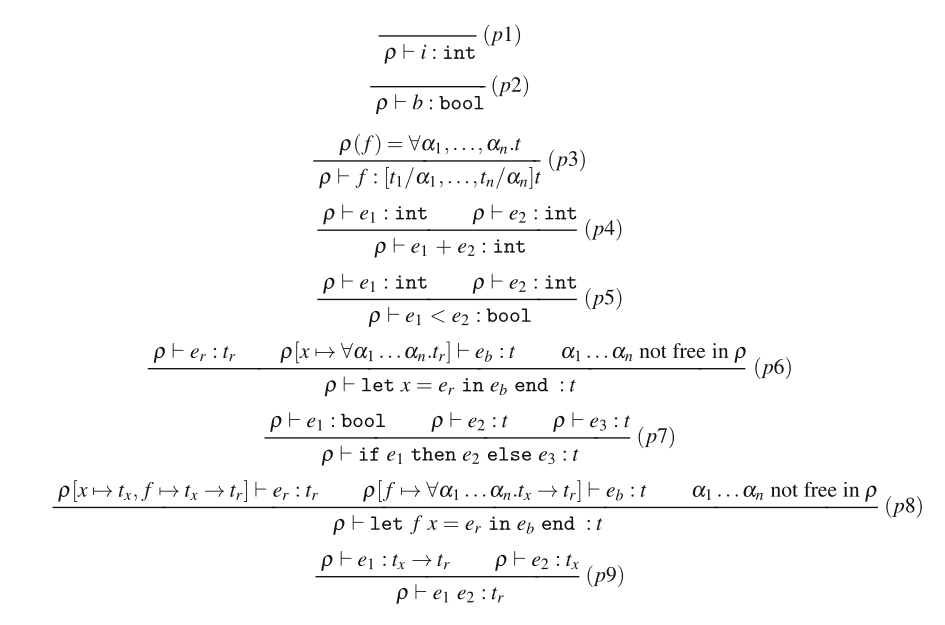

# Assignment 5 Exercises
Assigned exercises: 6.4, 6.5, 7.1, 7.2, and 7.3.



## Exercise 6.4

This exercise concerns type rules for ML-polymorphism, as shown in Fig. 6.1.

1. Build a type rule tree for this micro-ML program. In the `let` body, the type of `f` should be polymorphic. Why?

   ```text
   let f x = 1
   in f f end
   ```

2. Build a type rule tree for this micro-ML program. In the `let` body, `f` should not be polymorphic. Why?

   ```text
   let f x = if x<10 then 42 else f(x+1)
   in f 20 end
   ```

## Exercise 6.5

Download `fun2.zip` and build the micro-ML higher-order type inference as described in point F of `README.TXT`.

### 1. Infer the types

Use the type inference on the micro-ML programs below and report the type of each program. Some inferences will fail because the programs are not typable in micro-ML; explain why in those cases.

```text
let f x = 1
in f f end
```

```text
let f g = g g
in f end
```

```text
let f x =
	let g y = y
	in g false end
in f 42 end
```

```text
let f x =
	let g y = if true then y else x
	in g false end
in f 42 end
```

```text
let f x =
	let g y = if true then y else x
	in g false end
in f true end
```

### 2. Write programs with these types

Write micro-ML programs for which the micro-ML type inference reports the following types:

- `bool -> bool`
- `int -> int`
- `int -> int -> int`
- `'a -> 'b -> 'a`
- `'a -> 'b -> 'b`
- `('a -> 'b) -> ('b -> 'c) -> ('a -> 'c)`
- `'a -> 'b`
- `'a`

The type arrow (`->`) is right-associative, so `int -> int -> int` is the same as `int -> (int -> int)`. The choice of type-variable names does not matter, so the type scheme `'h -> 'g -> 'h` is the same as `'a -> 'b -> 'a`.


## Exercise 7.1

Download `microc.zip` from the book homepage, unpack it to a folder named `MicroC`, and build the micro-C interpreter as explained in step (A) of `README.TXT`.

Run the `fromFile` parser on the micro-C example in `ex1.c`. In your solution, include the abstract syntax tree and identify its parts: declarations, statements, types, and expressions.

Run the interpreter on some of the provided micro-C examples, such as `ex1.c` and `ex11.c`. Both take an integer `n` as input. The former prints the numbers from `n` down to 1; the latter finds all solutions to the n-queens problem.

## Exercise 7.2

Write and run a few more micro-C programs to understand the use of arrays, pointer arithmetic, and parameter passing. Use the micro-C implementation in `Interp.fs` and the associated lexer and parser to run your programs, as in Exercise 7.1.

Be careful: the micro-C interpreter does not perform type checking, so nothing prevents you from accidentally overwriting arbitrary store locations and producing unexpected results. The type system of real C would catch some of these mistakes at compile time.

MicroC is very limited compared to actual C. You cannot use initializers in variable declarations such as `int i=0;`; use a declaration followed by a statement instead, as in `int i; i=0;`. There is no `for` loop unless you implement one (see Exercise 7.3). Also initialize all variables and array elements; this does not happen automatically in micro-C or C.

1. Write a micro-C program containing a function `void arrsum(int n, int arr[], int *sump)` that computes and returns the sum of the first `n` elements of `arr`. Return the result through the `sump` pointer. The program's `main` function must create an array containing 7, 13, 9, and 8, call `arrsum` on that array, and print the result using micro-C's non-standard `print` statement.

2. Write a micro-C program containing a function `void squares(int n, int arr[])` that fills `arr[i]` with `i*i` for `i = 0, ..., n - 1`, given `n` and an array `arr` of length at least `n`.

   Your `main` function should allocate an array holding up to 20 integers, call `squares` to fill it with `n` square numbers (where `n <= 20` is given as a parameter to `main`), then call `arrsum` from part 1 to compute and print the sum of the squares.

3. Write a micro-C program containing a function `void histogram(int n, int ns[], int max, int freq[])` that fills `freq` with the frequencies of the values in `ns`. When the function returns, `freq[c]` must equal the number of times `c` appears among the first `n` elements of `ns`, for `0 <= c <= max`. Assume all values in `ns` are between 0 and `max`, inclusive.

   For example, if `arr` contains `1 2 1 1 1 2 0` and you call `histogram(7, arr, 3, freq)`, then `freq[0]` is 1, `freq[1]` is 4, `freq[2]` is 2, and `freq[3]` is 0. `freq` must have at least four elements. What happens if it does not? Declare and allocate `freq` in `main`, then pass it to `histogram`. It does not work correctly in micro-C or C to stack-allocate the array in `histogram` and somehow return it to `main`. Print the contents of `freq` after the call.


## Exercise 7.3

Extend MicroC with a `for` loop, for example:

```c
for (i=0; i<100; i=i+1)
   sum = sum+i;
```

To do this, modify the lexer and parser specifications in `CLex.fsl` and `CPar.fsy`. You may also extend the micro-C abstract syntax in `Absyn.fs` by defining a new `Forloop` statement constructor in the `stmt` type, then add a corresponding case to the interpreter's `exec` function.

However, with a modest amount of cleverness (highly recommended), you do not need special abstract syntax for `for` loops or any interpreter changes. A `for` loop of the general form

```c
for (e1; e2; e3)
   stmt
```

is equivalent to this block:

```c
{
   e1;
   while (e2) {
      stmt
      e3;
   }
}
```

Therefore, it is sufficient to let the semantic action in the parser construct abstract syntax using the existing `Block`, `While`, and `Expr` constructors from the `stmt` type. Rewrite your programs from Exercise 7.2 to use `for` loops instead of `while` loops.